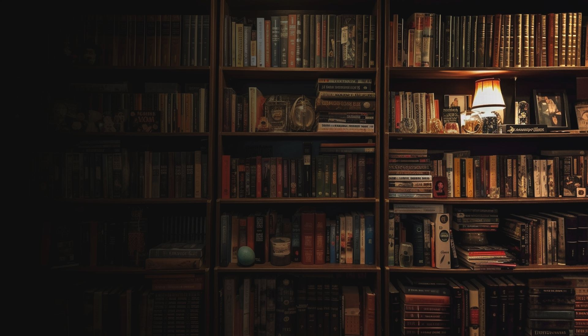
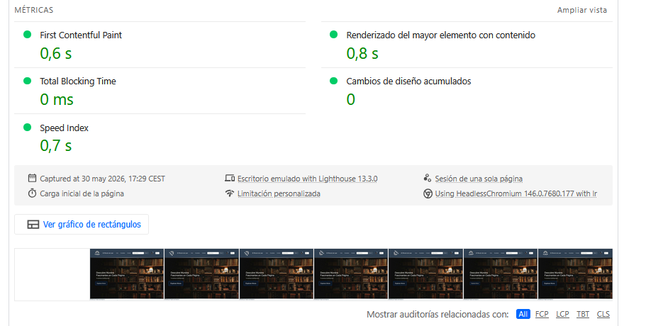

# 📚 **Librería Web — El Rincón de Leer**

Proyecto desarrollado para la asignatura **Diseño de Interfaces Web (DIW)**, Unidad 6 — 3ª evaluación.  
Consiste en una página web estática que simula una librería online, aplicando todo lo aprendido durante el curso.

**Autor:** Manuel Ramos Molina  
**IES Al‑Ándalus — Curso 2024/2025**

---

## 🚀 **Despliegue**

La web está publicada mediante **GitHub Pages**:

🔗 **https://manuelramosmolina.github.io/Libreria_Web/**

---

## 🛠️ **Tecnologías utilizadas**

- HTML5  
- CSS3  
- JavaScript  
- Git y GitHub  
- GitHub Pages (despliegue)

---

## 📂 **Estructura del proyecto**

Libreria_Web/
│
├── Iconos/               # Iconos de la interfaz
├── Imagenes/             # Fotografías y recursos gráficos
├── js/
│   ├── animacion.js      # Animación del logotipo
│   ├── main.js           # Funciones generales
│   └── ShoppingCart.mjs  # Lógica del carrito
│
├── index.html            # Página principal
├── busqueda.html         # Buscador de libros
├── carritoCompra.html    # Carrito de compra
├── contacto.html         # Formulario de contacto
├── ficha-libro01.html
├── ficha-libro02.html
├── ficha-libro03.html
├── ficha-libro04.html
│
├── styles.css            # Estilos generales
├── stylesCarrito.css     # Estilos del carrito
└── logo_animacion.css    # Animación del logo

---

## 🖼️ **Capturas del proyecto**

### 🏠 Página principal

### 🛒 Carrito de compra

---

## 📊 **Resultados de rendimiento (Desktop)**

Pruebas realizadas con **Lighthouse** en modo ordenador.

### 🖥️ Vista general del rendimiento

### ⚙️ Métricas detalladas

---

## 👨‍💻 **Autor**

**Manuel Ramos Molina**  
Estudiante de Desarrollo de Aplicaciones Web (DAW)  
IES Al‑Ándalus — Almería

---

## 📎 **Licencia**

Proyecto académico sin fines comerciales.

