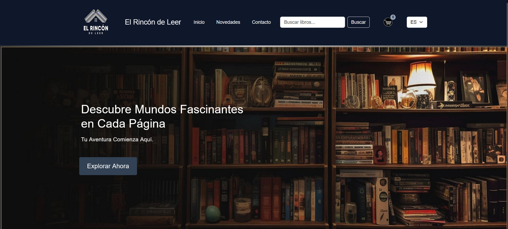
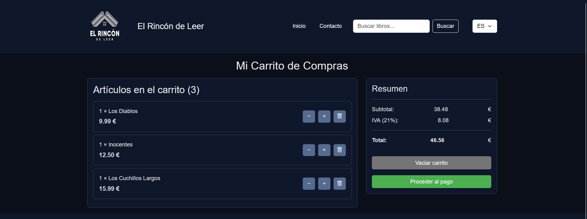
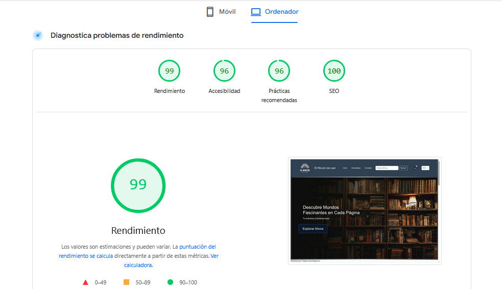

# 📚 **Librería Web — El Rincón de Leer**


Proyecto desarrollado para la asignatura **Diseño de Interfaces Web (DIW)**, Unidad 6 — 3ª evaluación.  
Consiste en una página web estática que simula una librería online, aplicando todo lo aprendido durante el curso.

**Autor:** Manuel Ramos Molina  
**IES Al‑Ándalus — Curso 2024/2025**

---

## 🚀 **Despliegue**

La web está publicada mediante **GitHub Pages**:

🔗 **https://manuelramosmolina.github.io/Libreria_Web/**

---

## 🛠️ **Tecnologías utilizadas**

- HTML5  
- CSS3  
- JavaScript  
- Git y GitHub  
- GitHub Pages (despliegue)

---

## 📂 **Estructura del proyecto**

```txt
Libreria_Web/
│
├── Iconos/
│   ├── Logo.png
│   └── Carrito.png
│
├── Imagenes/
│   ├── home.png
│   ├── carrito.png
│   ├── rendimiento01.png
│   ├── rendimiento02.png
│   └── ...
│
├── js/
│   ├── animacion.js
│   ├── main.js
│   └── ShoppingCart.mjs
│
├── index.html
├── busqueda.html
├── carritoCompra.html
├── contacto.html
├── ficha-libro01.html
├── ficha-libro02.html
├── ficha-libro03.html
├── ficha-libro04.html
│
├── styles.css
├── stylesCarrito.css
└── logo_animacion.css

## 🖼️ **Capturas del proyecto**

### 🏠 Página principal


### 🛒 Carrito de compra


---

## 📊 **Resultados de rendimiento (Desktop)**

Pruebas realizadas con **Lighthouse** en modo ordenador.

### 🖥️ Vista general del rendimiento


### ⚙️ Métricas detalladas


---

## 👨‍💻 **Autor**

**Manuel Ramos Molina**  
Estudiante de Desarrollo de Aplicaciones Web (DAW)  
IES Al‑Ándalus — Almería

---

## 📎 **Licencia**

Proyecto académico sin fines comerciales.


